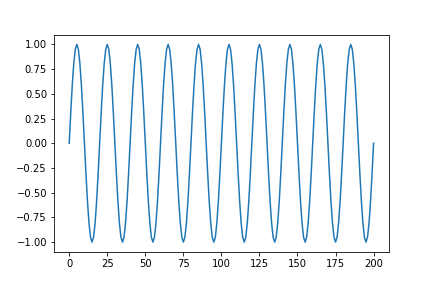

# Generating Audio

In this folder you will find some Python code (`generate_audio.py`) for generating audio. We first discuss some theory: (a) what is sound, and how might we represent it digitally, (b) sampling a wave form, (c) how to convert the samles to a `.wav` file that can be run through an audio player.


## Representing sound

The basic idea is as follows.  Sound waves are longitudinal waves of compression and rarefication of air pressure.  A graph of the air pressure *y(t)* at a fixed location might look like what you see in the figure below. We have graphed pressure versus time, where `y(t)` has the form = `A*sin(w*t)`, where *A* is the amplitude and *w* is the angular frequency.




To represent sound digitally, one first *samples* it, recording the values of *y(t)* at regular intervals.  The first seven samples might look like this:

```
   [0.0, 0.309, 0.588, 0.809, 0.951, 1.0, 0.951, ...]
```

Real-world sampling is done in a sequence of steps: a microphone converts pressure variations into voltage variations; an amplifier increases the amplitude of these variations; a sampler records the amplitude of the signal at regularly spaced intervals; the sampler, generating a stream of floating point numbers feeds the result to a digitizer, which produces a stream of bytes which are written to a file in an appropriate format.

Below we show how this entire process can be done in software.  We generate a waveform using a function like `A*sin(w*t)`, sample it algorithmically, convert the resulting array of floating point numbers to a byte sequence one element at a time, writing the result to a file in an appropriate format.

## Taking the samples

Fine, we can represent sound digitally by sampling the waveform to get an array of numbers, the sampled wave amplitudes. Standard audio playback software uses a sample rate of 44100 Hertz.   Thus, for every second of generated sound, we must "record" 44100 samples.  Let's do this for a pure sine wave of 440 Herz — the frequency of the standard tuning fork used by musicians.  The first step is to define the quantties used in the computation:

```
FREQUENCY = 440             # Hertz
AMPLITUDE = 255             # Max 255
DURATION = 2                # seconds
SAMPLERATE = 44100          # Don't change

SAMPLESIZE = SAMPLERATE * DURATION 
```

Next, we construct an array of integers,  `0, 1, 2, ..., SAMPLESIZE` that will be used to take the samples:

```
  index = np.arange(SAMPLESIZE)
```

To take the samples, we evaluate the function

```
  n -> AMPLITUDE*np.sin(2 * np.pi * FREQUENCY * n / SAMPLERATE)
```

on the array of integers we just constructed:

```
  samples = AMPLITUDE*np.sin(2 * np.pi * FREQUENCY * index / SAMPLERATE)
```

As a check on our work, note that both FREQUENCY and SAMPLERATE are in Hertz, so their quotient is dimensionless. The elements of the array `index` are integers, and so are dimensionless.  We conclude that the argument of the sine function is dimensionless, as it should be.

## Saving the samples to a file

The final step is to save the array of samples in a file.  We will do this using the `wave` library.  After importing it, we can set up a file in which to save the array:


```
output = wave.open('sine.wav', 'w')
```


For the file to be saved in the correct format, some parameters must be set:
 
```
output.setparams((2, 2, SAMPLERATE, 0, 'NONE', 'not compressed'))
```

We can now write the samples to the file in the correct format

```
for s in samples:
    packed_value = struct.pack('h', s)
    output.writeframes(packed_value)
    output.writeframes(packed_value)
```


Finally, as always, files that have been opened must be closed:

```
output.close()
```

## Credits

The code in `generate_audio.py` is based on that described in the two articles below:

- [It is ridiculously easy to generate any audio signal using Python](https://thehackerdiary.wordpress.com/2017/06/09/it-is-ridiculously-easy-to-generate-any-audio-signal-using-python/) — by 153armstrong
  
- [Fastest way to generate WAV files in Python, using the wave module](https://soledadpenades.com/posts/2009/fastest-way-to-generate-wav-files-in-python-using-the-wave-module/) — by Soledad Penadés
